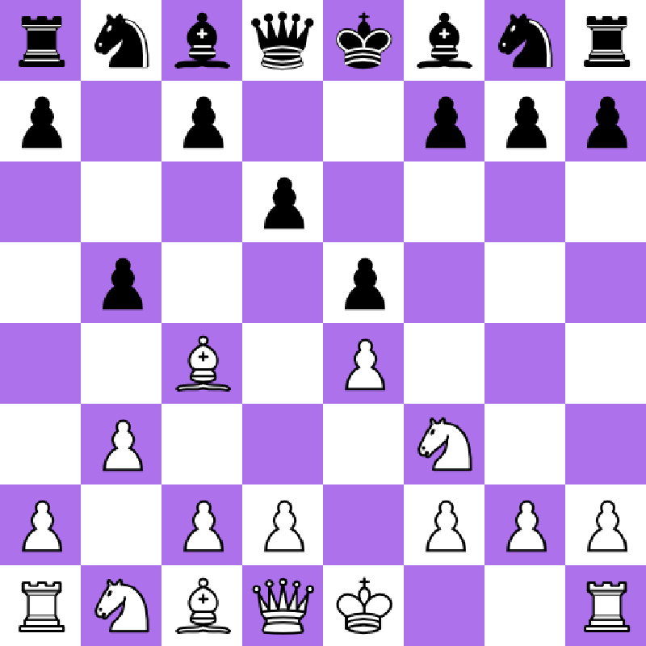
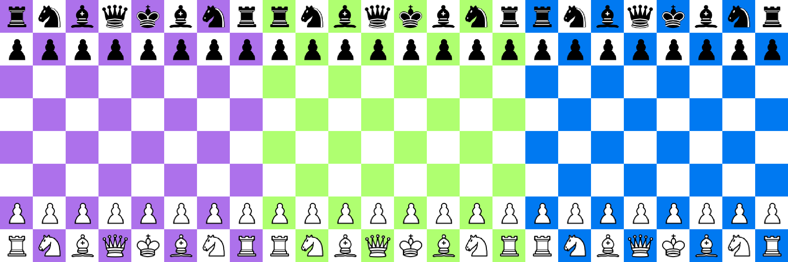
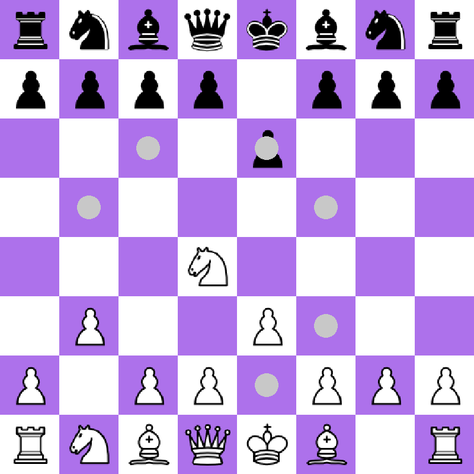

# C-hess

## Overview
A chess game that aspires to be a chess engine.
A project to challenge my reasoning and programming skills, since I targeted not to watch any tutorial, web, or asking AI about how a chess game is programmed.


### Dynamic board construction
The board is drawn at execution time, you can change the themes xd.



Change the `include.h` file at the line *73* with the RGB code of the desired dark square color. You can also change the light square in next line, but is not recommended if you don't have experimented with chess themes.
``` c
Color darkSquareColor = {173,113,235,255};      //Purple
Color lightSquareColor = {255,255,255,255};     //White
```
### Legal moves highlighting
Highlights the legal moves based on (almost) all the chess rules. It was a pain to program.


#### Castleing!


#### Pawns!


## Background
I didn't read any kind of documentation about how a chess game is made, that is why it could be awful, nevertheless, i want to improve it until it can be a chess engine, maybe the worst optimized or functional, but then I would have gotten more knowledge and skills, that's what matters, doesn't it?
## Schedule
- Windows executable: never, no necessity
- Add all special moves
- Add notation
